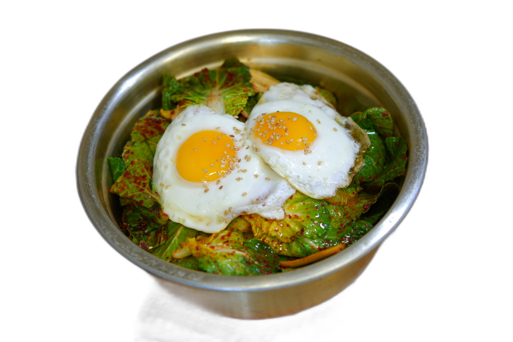

# 봄동 비빔밥

## 1. 레시피 소개

| 조리시간 | 난이도 | 인분 |
|---------|--------|------|
| 15분 | ⭐ 쉬움 | 1인분 |

> 아삭한 봄동과 매콤달콤 양념장이 어우러진, 봄 향기 가득한 비빔밥

## 2. 재료

### 본 재료
- 밥 — 1공기 (약 200g)
- 봄동 — 3~4잎 (한 줌 정도)
- 달걀 — 1개
- 깨소금 — 약간
- 식용유 — 약간

### 양념장 (둘 중 택 1)

**A. 고춧가루 양념장** — 매콤새콤, 입맛 확 살아나는 맛
- 고춧가루 — 1큰술
- 참기름 — 1큰술
- 간장 — 1/2큰술
- 설탕 — 1/2작은술
- 식초 — 1작은술
- 다진 마늘 — 1/2작은술
- 매실액 — 1/2작은술 (없으면 생략 가능)

**B. 간장 양념장** — 고소담백, 안 매운 버전
- 간장 — 1큰술
- 참기름 — 1큰술
- 들기름 — 1/2큰술 (없으면 참기름으로 대체)
- 설탕 — 1/2작은술
- 식초 — 1/2작은술
- 다진 마늘 — 1/2작은술
- 깨소금 — 약간

## 3. 만드는 법

### 재료 손질
1. 봄동은 흐르는 물에 깨끗이 씻은 뒤, 한입 크기로 손으로 뜯거나 칼로 썰어주세요. 물기를 살짝 털어주세요.

### 양념장 만들기
2. 원하는 양념장을 골라 재료를 한 그릇에 넣고 골고루 섞어주세요.
   - **A. 고춧가루 양념장:** 고춧가루 1큰술, 참기름 1큰술, 간장 1/2큰술, 설탕 1/2작은술, 식초 1작은술, 다진 마늘 1/2작은술, 매실액 1/2작은술을 섞어주세요.
   - **B. 간장 양념장:** 간장 1큰술, 참기름 1큰술, 들기름 1/2큰술, 설탕 1/2작은술, 식초 1/2작은술, 다진 마늘 1/2작은술, 깨소금 약간을 섞어주세요.

### 조리 & 플레이팅
3. 팬에 식용유를 살짝 두르고 달걀 프라이를 반숙으로 부쳐주세요. 노른자가 터지지 않게 살살 다뤄주세요!
4. 넓은 그릇에 따뜻한 밥을 담고, 손질한 봄동을 밥 위에 듬뿍 올려주세요.
5. 양념장을 봄동 위에 얹고, 반숙 달걀 프라이를 올린 뒤 깨소금을 뿌려주세요.
6. 숟가락으로 쓱쓱 비벼서 드세요!

## 4. 꿀팁
- 봄동은 익히지 않고 생으로 비벼 먹는 게 포인트예요! 아삭아삭한 식감이 살아있어야 맛있어요.
- 양념장에 식초를 넣으면 새콤함이 더해져 봄동 특유의 쌉싸름한 맛과 잘 어울려요.
- 참치캔, 멸치볶음, 김 부스러기 등을 곁들이면 더 풍성한 한 끼가 돼요.
- 봄동 대신 얼갈이배추나 쌈배추로 대체할 수 있어요.
- 팬 하나로 달걀만 부치면 되니까 설거지도 간단해요!
- 봄동은 3~5월이 제철이에요. 제철 봄동은 잎이 연하고 단맛이 나서 생으로 먹기에 딱 좋아요.
