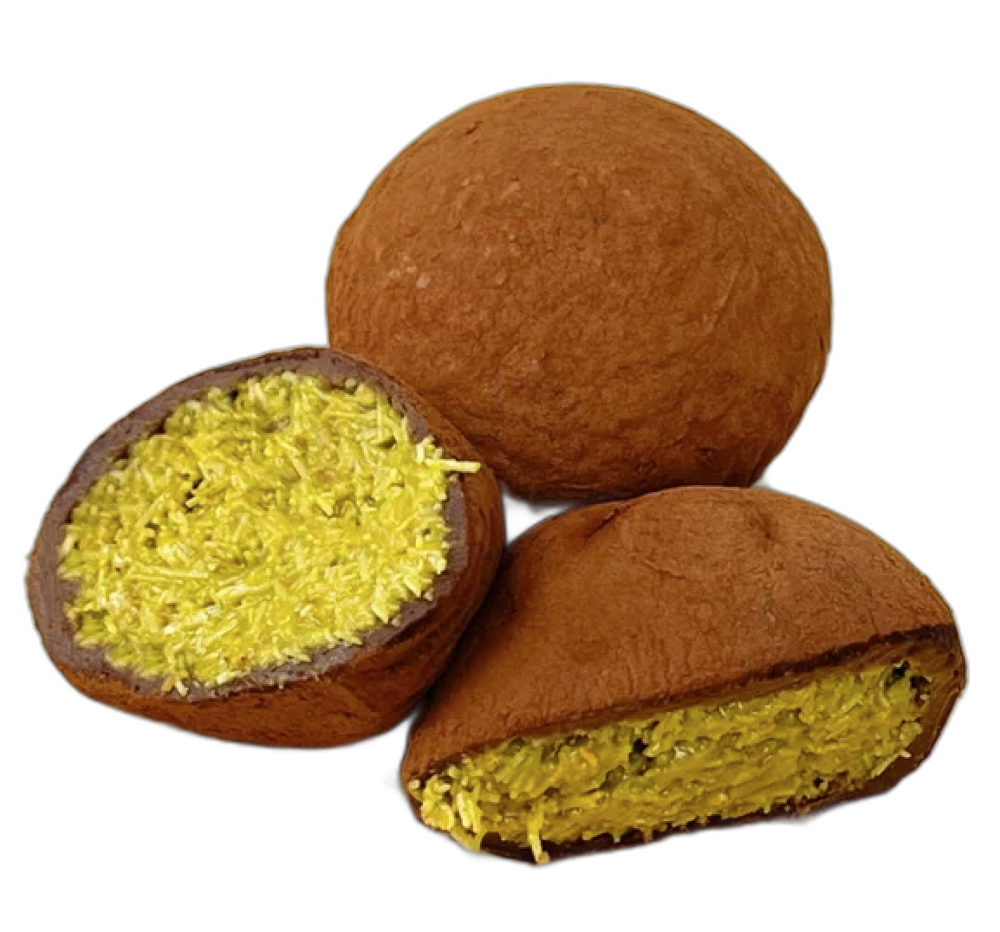

# 두바이쫀득볼 (두바이쫀득쿠키)

## 1. 레시피 소개

| 조리시간 | 난이도 | 분량 |
|---------|--------|------|
| 40분 (냉동 30분 포함) | ⭐⭐ 보통 | 약 10~12개 |

> 겉은 쫀득, 속은 바삭고소! 마쉬멜로우 반죽에 피스타치오 카다이프 필링을 넣은 두바이 디저트

## 2. 재료

### 본 재료 (마쉬멜로우 반죽)
- 마쉬멜로우 — 150g
- 버터 — 60g
- 탈지분유 — 12g
- 코코아파우더 — 50g (마무리 코팅용 별도)

### 필링 (피스타치오 카다이프)
- 카다이프면 — 120g
- 피스타치오 스프레드 — 120g
- 화이트초콜릿 — 30g

## 3. 만드는 법

### 필링 준비
1. 카다이프면을 오븐 170도에서 황금빛이 될 때까지 바삭하게 구워주세요. (오븐이 없으면 팬에 약불로 볶아도 돼요.)
2. 화이트초콜릿 30g을 전자레인지에 30초씩 돌려가며 녹여주세요.
3. 볼에 피스타치오 스프레드 120g, 녹인 화이트초콜릿 30g, 구운 카다이프 120g을 넣고 골고루 섞어주세요.
4. 필링을 한 입 크기(약 15~20g)로 동그랗게 빚어 트레이에 올린 뒤, 냉동실에서 30분간 단단하게 굳혀주세요.

### 반죽 만들기
5. 냄비에 버터 60g과 마쉬멜로우 150g을 넣고 약불에서 주걱으로 저어가며 완전히 녹여주세요.
6. 불을 끄고 탈지분유 12g, 코코아파우더 50g을 넣고 주걱으로 빠르게 섞어 매끈한 반죽을 만들어주세요.

### 성형 & 마무리
7. 손에 식용유를 바르거나 오일을 바른 비닐장갑을 끼고, 반죽을 적당량 떼어 납작하게 편 뒤 냉동해둔 필링을 가운데 올려주세요.
8. 반죽으로 필링을 감싸 동그랗게 모양을 잡아주세요.
9. 완성된 쫀득볼을 코코아파우더에 굴려 전체에 파우더를 입혀주세요.

## 4. 꿀팁
- 탈지분유가 없으면 우유맛 스틱(우유깡)을 갈아서 대체하거나, 자판기용 커피믹스 속 분유를 사용해도 돼요.
- 카다이프를 구하기 어려우면 소면을 기름에 바삭하게 튀긴 뒤 잘게 부숴서 대체할 수 있어요.
- 마쉬멜로우 반죽은 식으면 굳어지니까 빠르게 작업하는 게 포인트예요!
- 반죽이 손에 붙으면 손에 식용유를 자주 덧발라주세요.
- 냉장 보관 시 최대 5일, 냉동 보관 시 최대 2주까지 가능해요.
- 냉장 보관하면 겉바속쫀 식감, 상온에 잠깐 두면 더 부드러운 식감을 즐길 수 있어요.
