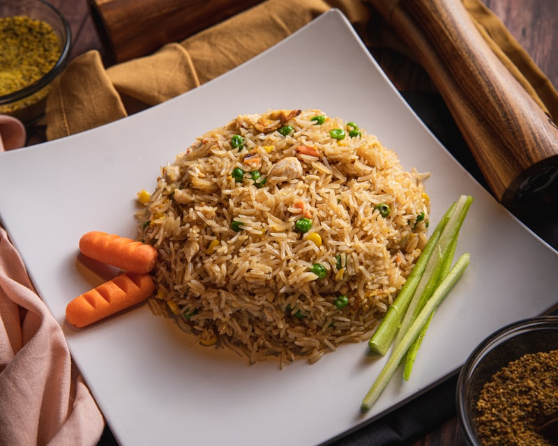

# 굴소스 볶음밥

> ⏱️ 조리시간: 10분 | 🍽️ 1인분 | 난이도: ⭐ 쉬움

## 📝 재료
- 밥 — 1공기 (약 200g, 찬밥이면 더 좋아요!)
- 달걀 — 1개
- 굴소스 — 1.5큰술
- 대파 또는 쪽파 — 1/4대 (없으면 생략 가능)
- 당근 — 1/4개 (없으면 생략 가능)
- 식용유 — 1큰술
- 간장 — 1/2작은술
- 참기름 — 1/2작은술 (마무리용, 없으면 생략 가능)
- 소금, 후추 — 약간

## 👨‍🍳 만드는 법
1. 대파와 당근이 있다면 잘게 다져두세요. 채소 준비는 이것으로 끝이에요!
2. 팬에 식용유를 두르고 중강불로 달군 뒤, 달걀을 넣고 젓가락으로 빠르게 스크램블하세요. 반숙 상태일 때 바로 다음 단계로 넘어가세요.
3. 달걀이 반숙 상태일 때 다진 채소를 넣고 30초간 함께 볶아주세요.
4. 밥을 넣고 주걱으로 눌러가며 밥알이 고루 퍼지도록 1~2분간 볶아주세요. 찬밥이면 더 잘 볶아져요!
5. 굴소스와 간장을 넣고 밥 전체에 고루 섞이도록 1분간 더 볶아주세요. 색이 골고루 배면 완성이 가까워요!
6. 불을 끄고 참기름을 두른 뒤 소금, 후추로 간을 맞추면 완성이에요!

## 💡 꿀팁
- 찬밥을 사용하면 밥알이 뭉치지 않고 훨씬 맛있게 볶아져요. 갓 지은 밥이라면 넓게 펼쳐 5분 정도 식혀주세요.
- 팬 하나로 처음부터 끝까지 조리하면 설거지가 팬 하나뿐이에요!
- 굴소스가 없다면 간장 1큰술 + 설탕 1/2작은술로 대체할 수 있어요.
- 냉장고 속 자투리 채소(양파, 냉동 옥수수, 김치 등)를 함께 넣으면 더 풍성해져요.
- 밥을 넣은 후 너무 자주 젓지 말고 눌러서 바닥을 살짝 볶아주면 고소한 누룽지 향이 나요.
