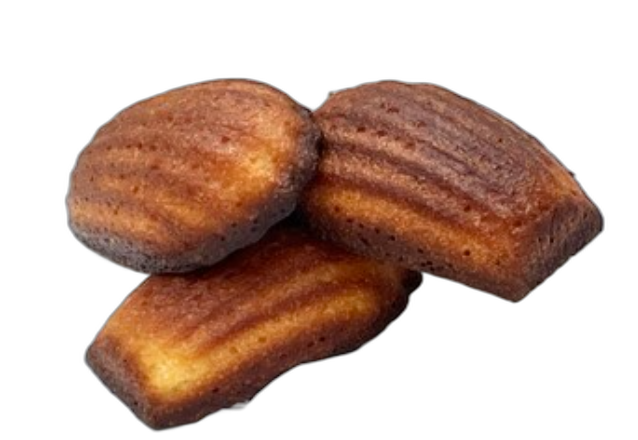

# 상하이식 버터떡 (황유우니엔까오)

## 1. 레시피 소개

| 조리시간 | 난이도 | 분량 |
|---------|--------|------|
| 40분 (굽기 30분 포함) | ⭐ 쉬움 | 약 12개 (마들렌 틀 기준) |

> 겉은 바삭, 속은 쫀득! 버터 향 가득한 중국 상하이 인기 간식

## 2. 재료

### 본 재료 (반죽)
- 건식 찹쌀가루 — 170g
- 타피오카 전분 — 20g
- 계란 — 1개 (상온)
- 우유 — 200ml (상온)
- 버터 — 40g (녹인 것)
- 설탕 — 45g (약 3큰술)
- 소금 — 1g
- 바닐라 에센스 — 1작은술 (없으면 생략 가능)

### 틀 준비용
- 버터 — 약간 (틀에 바르는 용)

## 3. 만드는 법

### 재료 준비
1. 버터 40g을 전자레인지에 30초씩 2~3번 돌려 완전히 녹여주세요.
2. 계란과 우유는 미리 냉장고에서 꺼내 상온으로 맞춰주세요. (차가우면 버터가 굳을 수 있어요!)

### 반죽 만들기
3. 볼에 우유 200ml, 녹인 버터 40g, 계란 1개, 설탕 45g, 소금 1g, 바닐라 에센스 1작은술을 넣고 거품이 나지 않게 살살 섞어주세요.
4. 건식 찹쌀가루 170g과 타피오카 전분 20g을 넣고 핸드블렌더 또는 거품기로 덩어리 없이 곱게 섞어주세요.

### 굽기 & 마무리
5. 마들렌 틀(또는 머핀 틀)에 버터를 골고루 바른 뒤, 반죽을 틀의 80% 정도까지 부어주세요.
6. 오븐 180도에서 30분 구워주세요. 윗면이 고르게 익지 않았다면 틀 위치를 바꿔 5분 더 구워주세요.
7. 틀에서 꺼내 따뜻할 때 바로 드세요! 겉바속쫀 식감이 최고예요!

## 4. 꿀팁
- 에어프라이어로 만들 때는 160도에서 20~25분 구워주세요. 중간에 한 번 뒤집어주면 골고루 익어요.
- 건식 찹쌀가루를 사용해야 해요! 습식 찹쌀가루는 수분이 많아 식감이 달라져요.
- 타피오카 전분이 겉의 바삭함을 만들어주는 핵심이에요. 없으면 감자전분으로 대체 가능해요.
- 따뜻할 때 먹으면 겉바속쫀, 식으면 쫀득한 떡 식감이에요. 식은 뒤 에어프라이어로 3분 데우면 바삭함이 살아나요.
- 반죽을 섞을 때 거품이 나지 않게 주의하세요. 거품이 나면 구웠을 때 표면이 고르지 않아요.
- 틀이 없으면 종이컵이나 머핀 유산지를 사용해도 괜찮아요.
